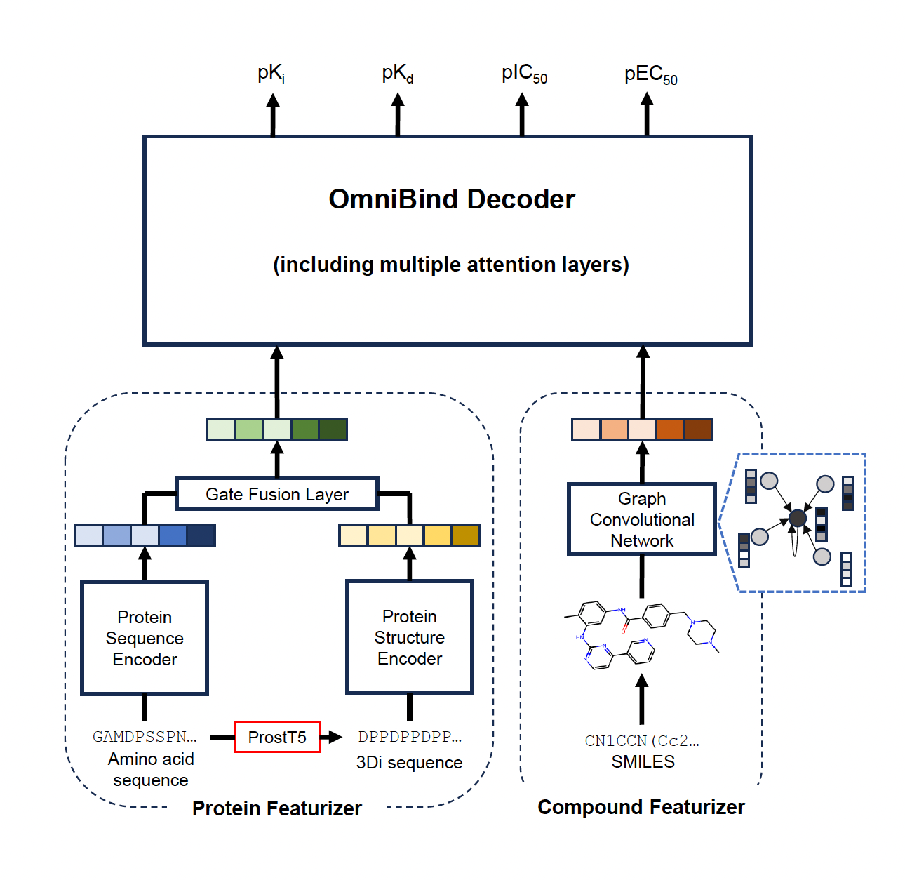

# OmniBind

**Pan–Pharmacological Drug–Target Interaction Prediction with 3D–Informed Protein Encoding at Scale**



[](https://opensource.org/licenses/MIT)
[](https://www.python.org/downloads/)

OmniBind is a unified framework for predicting compound-protein interactions (CPIs) that simultaneously predicts four binding affinity metrics (Ki, Kd, IC50, EC50) using both amino acid sequences and 3Di structural alphabet sequences via adaptive gated fusion.

## System Requirements

### Software Dependencies

- Python >= 3.9
- PyTorch >= 2.0.0 (CUDA-enabled recommended)
- RDKit >= 2022.9
- tape-proteins == 0.5
- hydra-core >= 1.3.0
- See `requirements.txt` for full list

### Tested Operating Systems

- Ubuntu 20.04 LTS / 22.04 LTS
- CentOS 7/8

### Hardware Requirements

- **Minimum**: 1 NVIDIA GPU with >= 12 GB VRAM (e.g., RTX 3080)
- **Recommended**: NVIDIA A100 (40 GB) or equivalent for training
- CPU-only inference is supported but significantly slower
- Optional: Multiple GPUs with Horovod for distributed training

## Installation Guide

### 1. Create conda environment

```bash
conda create -n omnibind python=3.9 -y
conda activate omnibind
```

### 2. Install PyTorch (with CUDA)

```bash
# For CUDA 12.1 (adjust for your CUDA version)
pip install torch torchvision torchaudio --index-url https://download.pytorch.org/whl/cu121
```

### 3. Install RDKit

```bash
conda install -c conda-forge rdkit -y
```

### 4. Install OmniBind and dependencies

```bash
pip install -r requirements.txt
pip install -e .
```

### 5. (Optional) Install Horovod for distributed training

```bash
HOROVOD_WITH_PYTORCH=1 pip install horovod
```

Typical installation time: **5-15 minutes** on a standard desktop computer.

## Demo

### Quick inference with sample data

```python
from omnibind.model import build_model
from omnibind.predict import predict_single, load_model
from omegaconf import OmegaConf

# Load config
cfg = OmegaConf.load("configs/default.yaml")
cfg.model.type = "aa3di_gmf"
cfg.training.device = "cuda"  # or "cpu"

# Load model (requires trained checkpoint)
model = load_model(cfg, "checkpoints/application.pth")

# Predict binding affinity
result = predict_single(
    smiles="CN1CCN(Cc2ccc(cc2)C(=O)Nc2ccc(C)c(Nc3nccc(n3)-c3cccnc3)c2)CC1",  # Imatinib
    aa_sequence="MSHHWGYGKHNGPEHWHK...",  # Target protein AA sequence
    sa_sequence="DAFCDPPRRLVPCCVPQV...",  # Target protein 3Di sequence
    model=model,
    cfg=cfg,
)
print(f"Predicted pKi:   {result['predicted_ki']:.4f}")
print(f"Predicted pKd:   {result['predicted_kd']:.4f}")
print(f"Predicted pIC50: {result['predicted_ic50']:.4f}")
print(f"Predicted pEC50: {result['predicted_ec50']:.4f}")
```

**Expected output**: Four predicted affinity values (pKi, pKd, pIC50, pEC50), each typically in the range of 3-12.

**Demo run time**: < 1 second per compound-protein pair on a standard GPU.

## Usage

### Training

```bash
# Single GPU training
python scripts/train.py \
    dataset.data_dir=./data/processed/seed42 \
    training.epochs=50 \
    training.batch_size_train=8

# Distributed training with Horovod (4 GPUs)
horovodrun -np 4 python scripts/train.py \
    dataset.data_dir=./data/processed/seed42
```

### Testing

```bash
python scripts/test.py \
    dataset.data_dir=./data/processed/seed42 \
    test.checkpoint_path=./checkpoints/benchmark/seed42.pth
```

### Applications

#### Drug Repositioning (batch compound screening)

```bash
python scripts/drug_repositioning.py \
    test.checkpoint_path=./checkpoints/application.pth \
    test.smiles_file=compounds.csv \
    test.aa="<target_aa_sequence>" \
    test.sa="<target_3di_sequence>"
```

#### Off-Target Screening (protein screening)

```bash
python scripts/offtarget_screening.py \
    test.checkpoint_path=./checkpoints/application.pth \
    test.fixed_smiles="<compound_smiles>" \
    test.seq_pkl_path=proteins_seq.pkl \
    test.ss_pkl_path=proteins_ss.pkl
```

#### Attention Map Extraction

```bash
python scripts/attention_map.py \
    test.checkpoint_path=./checkpoints/application.pth \
    test.smiles="<compound_smiles>" \
    test.aa="<aa_sequence>" \
    test.sa="<3di_sequence>" \
    test.name="analysis_name"
```

### Input Formats

- **SMILES**: Standard SMILES notation for compounds
- **AA sequence**: Single-letter amino acid sequence (uppercase)
- **3Di sequence**: Foldseek 3Di structural alphabet sequence (20-letter alphabet)

## Reproduction

To reproduce the paper experiments:

1. Download and preprocess BindingDB data (see `data/README.md`)
2. Train models with 5 random seeds:

```bash
for seed in 42 123 369 777 2024; do
    python scripts/train.py \
        dataset.data_dir=./data/processed/seed${seed} \
        training.seed=${seed} \
        training.epochs=50
done
```

OmniBind trains all four affinity metrics (Ki, Kd, IC50, EC50) simultaneously via multi-task learning.

3. Evaluate on test sets:

```bash
python scripts/test.py \
    dataset.data_dir=./data/processed/seed42 \
    test.checkpoint_path=./checkpoints/benchmark/seed42.pth
```

## Directory Structure

```
OmniBind/
├── omnibind/                   # Core library
│   ├── __init__.py
│   ├── model.py                # Model architectures (5 variants)
│   ├── data_utils.py           # Dataset and collation
│   ├── featurization.py        # Molecular and protein featurization
│   ├── train.py                # Training loop (single/distributed)
│   ├── evaluate.py             # Test evaluation
│   ├── predict.py              # Inference interface
│   └── utils.py                # Utilities
├── configs/                    # Hydra configuration files
│   ├── default.yaml
│   ├── dataset/
│   ├── optimizer/
│   └── scheduler/
├── scripts/                    # Entry point scripts
│   ├── train.py
│   ├── test.py
│   ├── attention_map.py
│   ├── drug_repositioning.py
│   └── offtarget_screening.py
├── data/
│   ├── README.md               # Data download and preprocessing instructions
│   ├── sample/                 # Sample data for demo
│   └── preprocessing/          # Data preprocessing scripts
├── checkpoints/
│   └── README.md               # Download instructions for pre-trained weights
├── assets/                     # Figures for README
├── requirements.txt
├── setup.py
├── LICENSE
└── README.md
```

## Model Variants

| Model | Description | Protein Input |
|-------|-------------|---------------|
| `aa` | AA-only | Amino acid sequence |
| `3di` | 3Di-only | 3Di structural alphabet |
| `aa3di` | Simple fusion | AA + 3Di (addition) |
| `aa3di_caf` | Cross-attention fusion | AA + 3Di (bidirectional attention) |
| `aa3di_gmf` | **Gated fusion (default)** | AA + 3Di (adaptive gating) |

## Citation

```bibtex
@article{omnibind2025,
  title={Pan--Pharmacological Drug--Target Interaction Prediction with 3D--Informed Protein Encoding at Scale},
  author={},
  journal={},
  year={2025}
}
```

## License

This project is licensed under the MIT License - see the [LICENSE](LICENSE) file for details.
